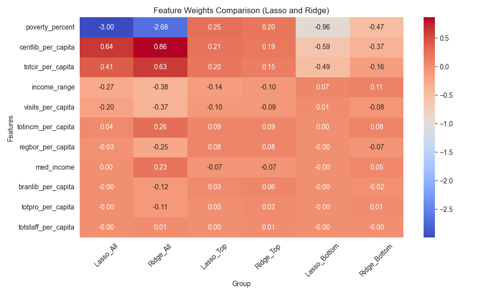
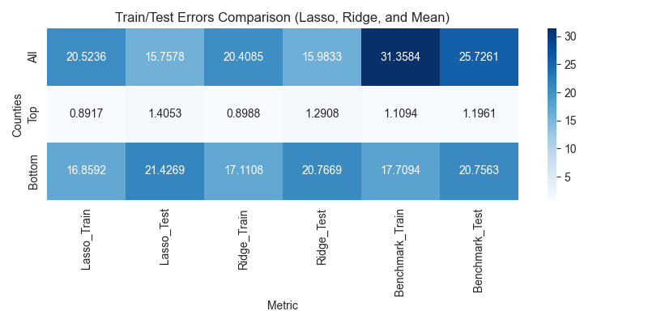

# Do Public Libraries Move High School Graduation Rates?

**Question:** after accounting for poverty and income, does public library access still predict county graduation rates?
**Approach:** ridge and lasso regression on 3,218 U.S. counties, combining Census, library-survey, and poverty data.
**Result:** poverty dominates, but library access survives regularization — **central libraries and circulation per capita are the strongest positive predictors**, and borrowing matters more than visiting. The models cut test error by roughly **39%** against a predict-the-mean benchmark (15.8 vs. 25.7).

📄 [Full paper](Paper/library-graduation-paper.pdf) · 📓 [Notebook](Notebooks/econ_460.ipynb) · 📊 [Interactive maps and charts](Results/)



**In plain terms:** counties where people borrow more from public libraries tend to have higher high school graduation rates, even after accounting for how poor or wealthy the county is. Poverty still matters far more than anything else. The statistical methods used here (ridge and lasso regression) are designed to push unimportant factors toward zero, so the factors that remain are the ones the data really supports. This shows a pattern, not proof that libraries cause higher graduation rates.

---

## Motivation

A high school diploma shapes long-run earnings and community well-being. Public libraries are one of the few free educational resources available everywhere, including in underserved communities. This project asks:

- How strongly is public library access associated with graduation rates?
- How much of that relationship is really just socioeconomics?

## Data

County-level data for 2022, merged from three sources:

| Source | What it provides |
|---|---|
| American Community Survey (ACS) | High school graduation rate by county |
| Public Libraries Survey (PLS) | Visits, circulation, staffing, central and branch libraries — all per capita |
| Small Area Income and Poverty Estimates (SAIPE) | Poverty rate, median income, income range |

## Method

1. Aggregate and clean the three sources into one table of 3,218 counties.
2. Fit ridge and lasso regressions, choosing the regularization strength with 20-fold cross-validation. Regularization handles the heavy multicollinearity among library metrics and guards against overfitting.
3. Fit separately on **all counties**, the **top-performing** counties, and the **bottom-performing** counties to see whether the same factors matter across the distribution.
4. Compare against a predict-the-mean benchmark.

## Findings

| Feature | Ridge | Lasso |
|---|---|---|
| Poverty percentage | −2.68 | −3.00 |
| Central libraries (per capita) | 0.86 | 0.64 |
| Circulation (per capita) | 0.63 | 0.41 |

- **Socioeconomic factors dominate.** Poverty percentage is by far the strongest predictor, and it is negative.
- **Library access still matters.** Central libraries and circulation keep positive weights under lasso, which zeroes out most other library metrics.
- **Engagement beats foot traffic.** Circulation is positive; visits per capita is not.
- **The bottom is hard to model.** For the lowest-performing counties the models do no better than the benchmark on test data — low graduation rates have idiosyncratic local causes. LaGrange County, Indiana has high median income and low poverty, but a large Amish population keeps graduation rates very low.



## Limitations

- These are **associations, not causal estimates** — library investment and graduation rates may share unobserved causes.
- One cross-section (2022); no time dimension.
- Linear models only. Tree-based models and school/private library data are natural extensions.
- The paper reflects an earlier iteration of the analysis; where numbers differ, the notebook is current.

## Run it

```bash
git clone https://github.com/beckerchTRJ/ECON-Library-Project.git
cd ECON-Library-Project
pip install -r requirements.txt
jupyter notebook Notebooks/econ_460.ipynb
```

The interactive Plotly outputs in `Results/` are HTML files — download and open them in a browser.

## Credits

Developed for ECON 460: Economic Applications of Machine Learning at the University of Southern California, with Luke Alati, Dung Pham, Darian Ahmadizadeh, and Natasha Densiyuk. Data from the ACS, PLS, and SAIPE programs.
